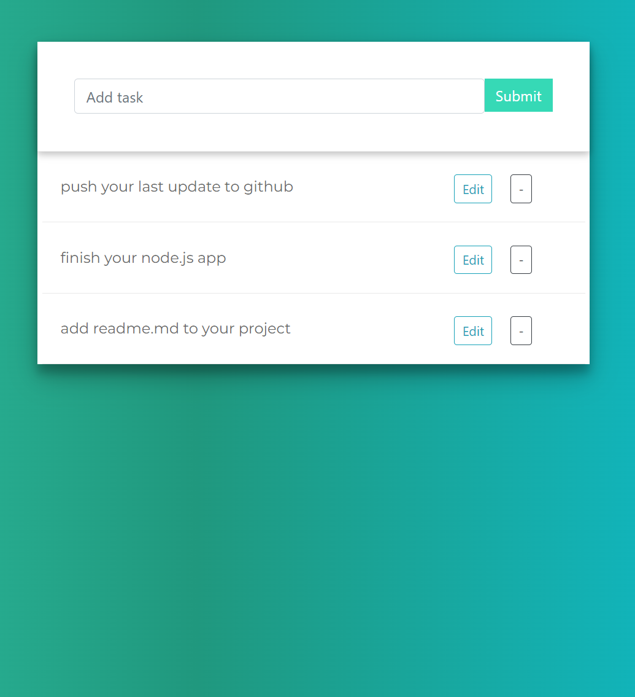

## Python and javaScript 

### Using RestFrameWork and Vanilla js

** in order to run code **
- install python 10.0.0 or higher
- create virtual enviromnet (optinal)
- open the project folder which manage.py located  
- open terminal 
- if you created virtual env activate if not just skipt this part
- run `pip install -r requirements.txt `

#### Some Pictures of App

